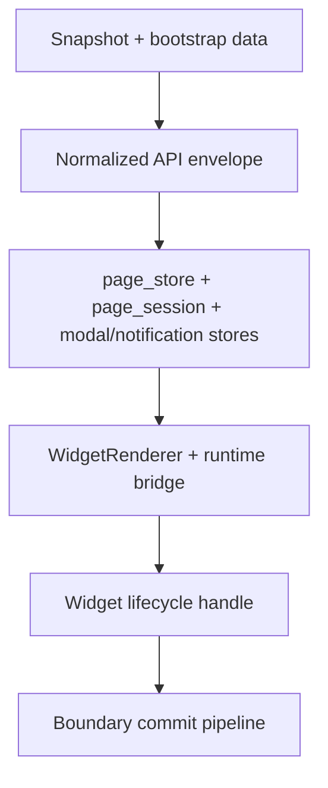

# Архитектура runtime

## Обзор

Frontend runtime разделён на несколько явных границ:

1. backend собирает versioned snapshot из YAML;
2. transport layer отдаёт **нормализованный envelope** (детали и исключения — [api-contracts.md](api-contracts.md));
3. page runtime раскладывает payload по stores и orchestration services;
4. widget tree рендерится через `WidgetDefinitionRegistry` и не знает про raw backend shape.

`frontend/js/page.ts` — thin export facade для `PageApp.vue`; page stores, lifecycle hooks, host services и flow wiring — `frontend/js/runtime/page_app_runtime.ts` и соседние helpers.

Исходники под `frontend/js` — TypeScript/Vue: widgets, action/table/datetime/voc helpers, host glue, root `tsconfig.json`. Оставшийся strict-долг — сужение внешних DOM/event и compatibility-controller границ.

Type-hole gate: `npm --prefix tooling/vite run type-holes`. Новые `: any`, `as unknown as`, `ThisType<any>`, TS suppressions и Vue compat markers — только с allowlist.

Companion docs для таблицы: [table-subsystem.md](table-subsystem.md), [table-state-invariants.md](table-state-invariants.md), [table-api-map.md](table-api-map.md), [table-testing-matrix.md](table-testing-matrix.md), [table-performance-notes.md](table-performance-notes.md), [table-runtime-notes.md](table-runtime-notes.md).

## Transport envelope и YAML runtime API

Страница и связанные данные грузятся через **один и тот же JSON envelope** (`ok`, `snapshot_version`, `snapshot_created_at`, `data`, `diagnostics`) — см. [api-contracts.md](api-contracts.md).

К **YAML snapshot runtime** относятся, среди прочего: `GET /api/page`, `GET /api/attrs`, `GET /api/modal-gui`, `POST /api/execute`, `GET /api/config`, `POST /api/reload`, **`GET /api/pages`**. Последний — **read-model** (плоский индекс страниц для lazy-сценариев вроде подписей у `split_button.url`), а не «обход» envelope: те же snapshot-meta и snapshot-level `diagnostics`, тело `data` другого shape — это отражено в контракте как `PagesIndexState`.

Отдельно от ядра страницы: **auth, user-settings, admin** — тот же envelope, но snapshot-meta часто `null`. Строгое исключение для потребителей ошибок: опциональные **плоские дубликаты** полей ошибки на корне ответа включаются только через `YAMLS_LEGACY_ERROR_ENVELOPE_DUPES` (канон — вложенный `error`); клиент уже читает `error.*` с fallback.

## Инварианты runtime

Сводные правила «кто единственный пишет/читает», чтобы не повторять их в каждом подразделе:

| Область | Инвариант |
| -------- | ---------- |
| `page_store` | Писать snapshot-derived поля могут **только** bootstrap / attrs / modal merge flows. |
| `page_session_store` | Committed widget values, загруженные attrs/modal ids, parsed GUI — меняются **только** через предусмотренные session/page flows, не из произвольного виджета. |
| `page_draft_runtime` | Владеет single-flight boundary и активным lifecycle handle; **не** смешивает layout, modal cache и committed values. |
| `modal_runtime_store` | Ephemeral modal UI; **только** orchestration с валидным `requestToken` пишет `status`, `modalConfig`, `error`, `restoreTargetViewId` (см. Modal Anti-Race). |
| `page_notification_store` | Snackbar — **только** через actions этого store. |
| `WidgetRenderer` | Единственная точка: `emitsInput` / `emitsExecute`, создание bind/unbind/dispose lifecycle handle. |
| Lifecycle handle | `bind` / `unbind` вызывает **только** `WidgetRenderer`; `commitPendingState` после unbind/dispose — `noop`. |
| Runtime bridge | Host services в subtree виджета попадают **только** через bridge от текущего `WidgetDefinition`; произвольный доступ к page stores из виджета — запрещён (см. Forbidden paths). |
| Registry | Ветвление по `widget.type` вне `factory.ts` / contract-слоя не расширяется ad hoc. |

## Запрещённые пути

Явные анти-паттерны (нарушение — баг или технический долг):

- **Виджеты не читают и не пишут `page_store` / `page_session_store` напрямую** — только через host bridge, события и предусмотренные API runtime.
- **Modal UI-слой** (`ModalManager`, произвольные виджеты) **не мутирует session store** (в т.ч. `widgetValues`, `parsedGui`) обходом modal/page services.
- **Чистые table-модули** (`table_*.ts` вне bridge) **не дергают fetch, window, глобальный page store и не запрашивают host services сами по себе** — интеграция через `table_page_bridge`, inject bridge, page-level loaders (см. [table-subsystem.md](table-subsystem.md)).
- **Prefetch** не меняет активное меню / вкладку / модалку; поздние async после invalid modal token — отбрасываются.

## Владение состоянием

Ниже — **что где лежит**; правила записи см. в разделе «Инварианты runtime» выше.

### Snapshot-derived state

`frontend/js/runtime/page_store.ts`: `pageName`, `snapshotVersion`, `diagnostics`, `pageConfig`, `attrsByName`.

### Session/page state

`frontend/js/runtime/page_session_store.ts`: `widgetValues`, `loadedAttrNames`, `loadedModalIds`, `parsedGui`. `widgetValues` — единственный committed источник для page/modal widgets; draft только внутри виджета до commit.

### Draft boundary runtime

`frontend/js/runtime/page_draft_runtime.ts`: `activeLifecycleHandle`, `boundaryToken`, `pendingBoundaryPromise`.

### Modal UI state

`frontend/js/runtime/modal_runtime_store.ts`: `activeModalId`, `modalConfig`, `status`, `activeTabIndex`, `collapsedSections`, `scrollTopByView`, `restoreTargetViewId`, `error`, `requestToken`. Определения модалок и `loadedModalIds` — в `page_session_store.ts`.

### Notifications

`frontend/js/runtime/page_notification_store.ts`: `snackbar`, `snackbarHideTimerId`, `snackbarSeq`.

## Контракт реестра виджетов (сводка)

Базовый contract: `frontend/js/widgets/factory.ts` — `WidgetDefinitionRegistry`. Полный текст правил: [widget-registry-contract.md](widget-registry-contract.md).

Каждое definition задаёт: `type`, `resolveComponent()`, `prefetch()`, `capabilities`, `createLifecycleHandle()`. Capabilities: `stateful`, `draftCommit`, `emitsInput`, `emitsExecute`, `runtimeFeatures` (`confirmModal`, `modalControl`, `notifications`, `errorHandling`, `attrsAccess`).

Инварианты доступа к registry/capabilities — в таблице раздела «Инварианты runtime».

## Жизненный цикл виджета

Handle: `bind(instance)`, `unbind()`, `commitPendingState(context)`, `dispose()`. `commitPendingState` — async, результат `LifecycleCommitResult`: `noop` / `committed` / `blocked` с `severity` и `error`.

Unknown тип: render через `SimpleInputWidget`, пустые capabilities, no-op lifecycle, один warning на тип/сессию — см. [widget-registry-contract.md](widget-registry-contract.md).

## Граница TypeScript у виджетов

**Источник истины по типам виджетов:** `frontend/js/shared/widget_types.ts` (`KNOWN_WIDGET_TYPE_NAMES` и производные), **регистрация и lazy-load компонентов:** `frontend/js/widgets/factory.ts`. Тип `table` — отдельный controller feature ([table-subsystem.md](table-subsystem.md)).

Общие Vue-компоненты runtime (`Md3Field.vue`, `ConfirmModal.vue`, `ModalManager.vue`, …) — typed `<script setup lang="ts">`.

Stateful виджеты сохраняют контракт: `getValue`, `setValue`, `commitPendingState` на границе registry; `commitDraft` — локально, boundary commit его не вызывает. Для ячеек таблицы см. методы pickers / `onArrowClick` в контракте table cell runtime.

API contracts: `frontend/js/runtime/api_contract.ts`; transport: `api_client_core.ts`; фасад: `api_client.ts`.

## Runtime bridge

Host services только через bridge (шаги: host object → `WidgetRenderer` по `WidgetDefinition` → узкий набор injections). Стабильные имена injections:

- `getConfirmModal`, `openUiModal`, `closeUiModal`, `showAppNotification`, `reportAppError`, `handleRecoverableAppError`
- `getWidgetAttrsByName`, `getWidgetRuntimeValueByName`, `getAllAttrsMap`, `getModalRuntimeState`, `getModalRuntimeController`
- draft: `setActiveWidgetLifecycle`, `clearActiveWidgetLifecycle`

## Порядок boundary commit

Все boundary actions через `draftRuntime.runBoundaryAction(kind, action)`:

1. запрос action;
2. single-flight lock;
3. `commitPendingState()` активного handle;
4. `noop` / `committed` → выполнить action;
5. `blocked` + recoverable → отмена + recoverable UI;
6. `blocked` + fatal → отмена + fatal host path.

Повторный trigger во время pending — тот же promise, вторая операция не создаётся.

Сценарии: навигация (`menu` / `tab` / `hash`), `execute`, закрытие модалки.

## Модалки: защита от гонок

`requestToken`: **только** последний token пишет критичные поля modal store; `closeModal`, unmount страницы и сброс store инвалидируют token; prefetch не трогает active UI state.

Оркестрация: `frontend/js/runtime/modal_runtime_service.ts`; `ModalManager.vue` — чтение state и вызов controller.

## Поток страницы

1. Bootstrap: embed или `page_bootstrap_flow.loadPageConfig`;
2. `page_store` ← snapshot-derived;
3. `page_session_store` ← committed values и parsed GUI;
4. `page_view_runtime` — menu/tab/hash/scroll;
5. `attrs_loader` — догрузка attrs и зависимостей таблицы;
6. `WidgetRenderer` — definition, bridge, lifecycle;
7. `PageApp.vue` — view + feedback layers.

## Runtime таблицы

1. `table_contract.ts` — границы типов/state;
2. `table_store.ts` — table state;
3. `table_runtime_registry.ts` + `useTableRuntime.ts` — orchestration;
4. `TableWidget.vue` — thin root;
5. прямые импорты между helpers, без import-order coupling.

## Модель ошибок и обратной связи

`frontend/js/runtime/error_model.ts` — единый контракт ошибок UI. Уровни: blocking page error (fatal host), recoverable (error model + snackbar), snapshot `diagnostics`, локальная validation виджета до commit.

## Связанные документы

- [docs/widget-registry-contract.md](widget-registry-contract.md)
- [docs/table-subsystem.md](table-subsystem.md)
- [docs/api-contracts.md](api-contracts.md)
- [docs/yaml-dsl.md](yaml-dsl.md)
